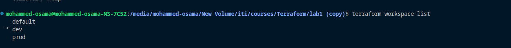

# Terraform Multi-Environment Infrastructure Deployment


## Introduction

This project demonstrates how to use Terraform to deploy infrastructure across multiple environments, specifically dev and prod, in different AWS regions (us-east-1 and eu-central-1). It also includes setting up network resources within a dedicated network module and using local-exec provisioners to print the public IP of a bastion EC2 instance.

## Table of Contents

1. [Project Structure](#project-structure)
    - [Environments](#environments)
    - [Network Module](#network-module)
    - [Deployment](#deployment)
    - [Local-Exec Provisioner](#local-exec-provisioner)
2. [GitHub Repository](#github-repository)
3. [Continuous Integration/Continuous Deployment (CI/CD)](#continuous-integrationcontinuous-deployment-cicd)
    - [Jenkins Integration](#jenkins-intergration)
4. [Email Notifications](#email-notifications)
    - [Email Verification with Amazon SES](#email-verification-with-amazon-ses)
    - [Lambda Function for Notifications](#lambda-function-for-notifications)
6. [Trigger and Email Notifications](#trigger-and-email-notifications)

## Project Structure

This project is organized into different components:

### Environments

Two workspaces, `dev` and `prod`, are created to manage infrastructure deployments separately. Corresponding variable definition files (`dev.tfvars` and `prod.tfvars`) hold environment-specific configurations.
#### workspaces

showing workspaces 
```bash
terraform workspace list
```


#### dev.tfvars 
```hcl
region = "eu-central-1"
ami = "ami-04e601abe3e1a910f"
instance_type = "t2.micro"
vpc_cidr = "10.0.0.0/16"
subnet_configs = {
    public_subnet1 = {
      cidr_block        = "10.0.1.0/24"
      availability_zone = "eu-central-1a"
      name              = "public_subnet1"
    },
    public_subnet2 = {
      cidr_block        = "10.0.2.0/24"
      availability_zone = "eu-central-1b"
      name              = "public_subnet2"
    }
    private_subnet1 = {
      cidr_block        = "10.0.3.0/24"
      availability_zone = "eu-central-1a"
      name              = "private_subnet1"
    },
    private_subnet2 = {
      cidr_block        = "10.0.4.0/24"
      availability_zone = "eu-central-1b"
      name              = "private_subnet2"
    }
  }
```
#### prod.tfvars 
```hcl
region = "us-east-1"
ami = "ami-053b0d53c279acc90"
instance_type = "t2.micro"
vpc_cidr = "10.0.0.0/16"
subnet_configs = {
    public_subnet1 = {
      cidr_block        = "10.0.1.0/24"
      availability_zone = "us-east-1a"
      name              = "us_public_subnet1"
    },  
    public_subnet2 = {
      cidr_block        = "10.0.2.0/24"
      availability_zone = "us-east-1b"
      name              = "us_public_subnet2"
    }
    private_subnet1 = {
      cidr_block        = "10.0.3.0/24"
      availability_zone = "us-east-1a"
      name              = "us_private_subnet1"
    },
    private_subnet2 = {
      cidr_block        = "10.0.4.0/24"
      availability_zone = "us-east-1b"
      name              = "us_private_subnet2"
    }
  }
```


### Network Module

Network resources are organized within a reusable network module to ensure consistent configurations across environments.

### Deployment

The Terraform code deploys infrastructure to AWS regions `us-east-1` and `eu-central-1` based on the selected workspace (environment).

### Local-Exec Provisioner

A local-exec provisioner is used to execute a command that prints the public IP of the bastion EC2 instance after deployment.

## GitHub Repository

The infrastructure code is uploaded to a GitHub repository for version control and collaboration.

## Continuous Integration/Continuous Deployment (CI/CD)

A Jenkins image with Terraform installed is created for CI/CD pipelines. A pipeline is configured to accept an environment parameter and apply the Terraform code to the selected environment.

### Jenkins and Terraform Image 

### Dockefile
### Jenkins Integration


## Email Notifications

Amazon SES is used to verify email addresses for sending notifications.

### Email Verification with Amazon SES
### Lambda Function for Notifications

A Lambda function is created to send email notifications when there are changes in the Terraform state files.

## Trigger and Email Notifications

A trigger mechanism is implemented to detect changes in the Terraform state files and send email notifications using the Lambda function and SES.

Refer to individual sections and the provided Terraform code for more details on each component.

## Getting Started

To get started, follow these steps:

1. Set up AWS credentials.
2. Clone this repository.
3. Configure the desired environment using `.tfvars` files.
4. Apply Terraform code using Jenkins or the command line.
5. Monitor changes and receive email notifications for state file changes.

## Contributing

Contributions to this project are welcome. Feel free to open issues or pull requests.

## License

This project is licensed under the [MIT License](LICENSE).


